# MyStockTrackerApp Performance Optimization
## Component Diagram

```mermaid
graph TD
    %% User Interface Components
    UI[User Interface] --> Dashboard
    UI --> PortfolioManagement
    UI --> ChartViews
    UI --> CashFlowViews[Cash Flow Views]
    
    %% Frontend Controllers
    Dashboard --> ViewController
    PortfolioManagement --> ViewController
    ChartViews --> ViewController
    CashFlowViews --> ViewController
    
    %% Primary Controller Layer
    ViewController --> DataController
    
    %% Core Services
    DataController --> CacheService
    DataController --> DataService
    DataController --> ProgressTracker
    
    %% Background Processing
    DataController -.-> BackgroundJobScheduler
    BackgroundJobScheduler --> BatchAPIProcessor
    
    %% Data Services
    DataService --> PortfolioService
    DataService --> PriceService
    DataService --> ChartService
    DataService --> CashFlowService
    DataService --> IRRCalculationService
    DataService --> ETFComparisonService
    
    %% Cache Components
    CacheService --> PriceCache[(Price Cache)]
    CacheService --> PortfolioCache[(Portfolio Cache)]
    CacheService --> ChartDataCache[(Chart Data Cache)]
    CacheService --> IRRCache[(IRR Cache)]
    CacheService --> CashFlowCache[(Cash Flow Cache)]
    CacheService --> ETFDataCache[(ETF Data Cache)]
    
    %% External Services
    BatchAPIProcessor --> YFinanceAPI[Yahoo Finance API]
    PriceService --> YFinanceAPI
    ETFComparisonService --> YFinanceAPI
    
    %% Database Layer
    PortfolioService --> Database[(PostgreSQL/SQLite)]
    PriceService --> Database
    CashFlowService --> Database
    IRRCalculationService --> Database
    
    %% Status Notifications
    ProgressTracker --> NotificationSystem
    NotificationSystem --> UI
    
    %% Cache Warming
    BackgroundJobScheduler -.-> CacheWarmer
    CacheWarmer --> CacheService
    
    %% Market Hours Service
    MarketHoursService --> CacheService
    MarketHoursService --> BackgroundJobScheduler
    
    %% XIRR and Cash Flow Specific
    IRRCalculationService --> CashFlowService
    IRRCalculationService --> ScipyXIRR[Scipy XIRR Calculation]
    ETFComparisonService --> IRRCalculationService
    ETFComparisonService --> CashFlowService
    
    %% Component Definitions with Responsibilities
    classDef component fill:#e9f7ef,stroke:#333,stroke-width:1px;
    classDef external fill:#f7e8e8,stroke:#333,stroke-width:1px,stroke-dasharray: 5 5;
    classDef storage fill:#e8f1f7,stroke:#333,stroke-width:1px;
    classDef new fill:#fbf3d6,stroke:#333,stroke-width:2px;
    classDef xirr fill:#f0e6f5,stroke:#333,stroke-width:2px;
    
    %% Apply Classes to Components
    class UI,Dashboard,PortfolioManagement,ChartViews,CashFlowViews component;
    class YFinanceAPI,ScipyXIRR external;
    class Database,PriceCache,PortfolioCache,ChartDataCache,IRRCache,CashFlowCache,ETFDataCache storage;
    class DataController,CacheService,BatchAPIProcessor,BackgroundJobScheduler,CacheWarmer,MarketHoursService,ProgressTracker,NotificationSystem new;
    class CashFlowService,IRRCalculationService,ETFComparisonService xirr;
    
    %% Component Notes
    subgraph "New Components"
        DataController["Data Controller<br><small>- Orchestrates data requests<br>- Decides between cache and API sources<br>- Prioritizes critical data</small>"]
        CacheService["Cache Service<br><small>- Manages cache reads/writes<br>- Implements intelligent invalidation<br>- Tracks data freshness</small>"]
        BatchAPIProcessor["Batch API Processor<br><small>- Handles efficient batch requests<br>- Reduces API calls by >99%<br>- Manages rate limiting</small>"]
        BackgroundJobScheduler["Background Job Scheduler<br><small>- Coordinates background updates<br>- Handles prioritization<br>- Manages worker processes</small>"]
        CacheWarmer["Cache Warmer<br><small>- Pre-populates cache during off-hours<br>- Prioritizes frequently accessed data<br>- Runs after market close</small>"]
        MarketHoursService["Market Hours Service<br><small>- Tracks market open/close times<br>- Determines cache freshness rules<br>- Guides update scheduling</small>"]
        ProgressTracker["Progress Tracker<br><small>- Monitors background jobs<br>- Updates UI with progress<br>- Tracks data freshness</small>"]
        NotificationSystem["Notification System<br><small>- Displays data freshness indicators<br>- Shows background progress<br>- Alerts on stale data</small>"]
    end
    
    subgraph "XIRR & Cash Flow Components"
        CashFlowService["Cash Flow Service<br><small>- Generates cash flows from transactions<br>- Tracks deposits, purchases, sales, dividends<br>- Supports filtering and exports</small>"]
        IRRCalculationService["IRR Calculation Service<br><small>- Calculates Internal Rate of Return<br>- Uses scipy for XIRR calculation<br>- Caches calculation results</small>"]
        ETFComparisonService["ETF Comparison Service<br><small>- Compares portfolio vs ETF performance<br>- Models dividend reinvestment<br>- Fetches real ETF price & dividend data</small>"]
        ScipyXIRR["Scipy XIRR<br><small>- Computational library<br>- Complex financial calculations<br>- High precision IRR algorithm</small>"]
    end
```

## Component Descriptions

### User Interface Layer
- **User Interface**: The main UI container that includes all visual components
- **Dashboard**: The primary landing page showing portfolio overview and performance
- **Portfolio Management**: UI for managing transactions, holdings, and dividends
- **Chart Views**: Interactive charts showing portfolio performance
- **Cash Flow Views**: Dedicated views for cash flow analysis and IRR calculations

### Controller Layer
- **View Controller**: Handles user interactions and coordinates with data layer
- **Data Controller** (New): Orchestrates all data operations with intelligent routing between cache and API sources

### Core Services
- **Cache Service** (New): Comprehensive caching system with smart invalidation strategies
- **Data Service**: Processes and transforms raw data into business entities
- **Portfolio Service**: Manages portfolio operations and calculations
- **Price Service**: Handles stock price retrieval and processing
- **Chart Service**: Generates visualization data for interactive charts

### XIRR and Cash Flow Services
- **Cash Flow Service**: Generates and analyzes cash flow data from transactions and dividends
- **IRR Calculation Service**: Performs Internal Rate of Return calculations using scipy
- **ETF Comparison Service**: Compares portfolio performance against market ETFs (VOO/QQQ)

### Background Processing
- **Background Job Scheduler** (New): Manages asynchronous tasks and background processing
- **Batch API Processor** (New): Efficiently processes API requests in batches to reduce call volume
- **Cache Warmer** (New): Pre-populates cache during off-hours to ensure fresh data availability
- **Progress Tracker** (New): Monitors and reports on background job progress

### Support Services
- **Market Hours Service** (New): Tracks market hours to optimize caching and update strategies
- **Notification System** (New): Provides user feedback about data freshness and background processes

### Storage Layer
- **Price Cache**: Stores historical and current price data
- **Portfolio Cache**: Stores calculated portfolio metrics
- **Chart Data Cache**: Stores pre-generated chart data
- **IRR Cache**: Stores calculated IRR values
- **Cash Flow Cache**: Stores processed cash flow data
- **ETF Data Cache**: Stores ETF price and dividend history
- **Database**: Primary data store (PostgreSQL in production, SQLite in development)

### External Services
- **Yahoo Finance API**: External data source for stock price information
- **Scipy XIRR**: External library for complex financial calculations

## Key Architectural Improvements

1. **Separation of Concerns**: Clear delineation between UI, controllers, services, and data access
2. **Intelligent Caching**: Multi-tiered caching strategy with smart invalidation
3. **Background Processing**: Non-blocking background jobs for intensive operations
4. **Batch Processing**: Efficient API usage through batching and parallelization
5. **Progressive Loading**: UI components load incrementally as data becomes available
6. **Market-Aware Logic**: Different strategies for market hours vs after hours
7. **User Feedback**: Clear indicators of data freshness and background operations
8. **XIRR Optimization**: Background processing for computationally intensive IRR calculations
9. **ETF Data Integration**: Efficient ETF data retrieval integrated with batch processing
10. **Cash Flow Caching**: Progressive caching for cash flow generation to avoid redundant calculations