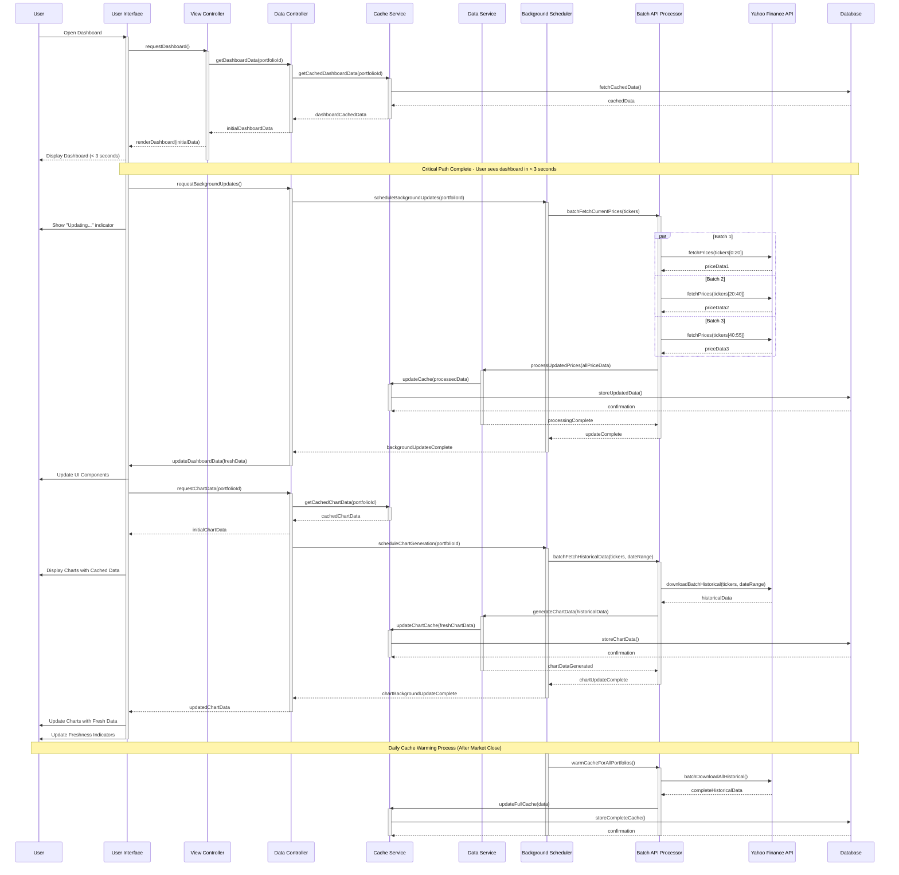

# MyStockTrackerApp Performance Optimization
## Dashboard Loading Sequence Diagram

## Sequence Description

This sequence diagram illustrates the optimized data flow for dashboard loading in MyStockTrackerApp, focusing on delivering a responsive user experience while efficiently handling data updates in the background.

### Critical Path (< 3 seconds)

1. **Initial Request**: User opens the dashboard, triggering the view controller
2. **Cached Data Delivery**: The Data Controller immediately retrieves cached data from the Cache Service
3. **Fast Initial Render**: The UI renders using cached data within 3 seconds
4. **Visual Indicators**: The user sees freshness indicators showing which data is cached

### Background Updates

1. **Background Processing**: After initial render, background updates are scheduled
2. **Parallel API Requests**: The Batch API Processor fetches current prices in parallel batches
3. **Progressive Updates**: As fresh data becomes available, the UI updates components progressively
4. **User Feedback**: The UI provides visual indicators of update progress

### Chart Data Processing

1. **Initial Charts**: Charts are first displayed using cached data
2. **Background Generation**: Fresh chart data is generated in a background process
3. **Update When Ready**: Charts update with fresh data when processing completes

### Cache Warming

1. **After-Hours Processing**: Background jobs warm the cache after market close
2. **Complete Historical Data**: All required historical data is pre-fetched
3. **Ready for Next Day**: Ensures optimal performance during market hours

This optimized flow ensures users always see dashboard data within 3 seconds while providing transparency about data freshness and background updates.