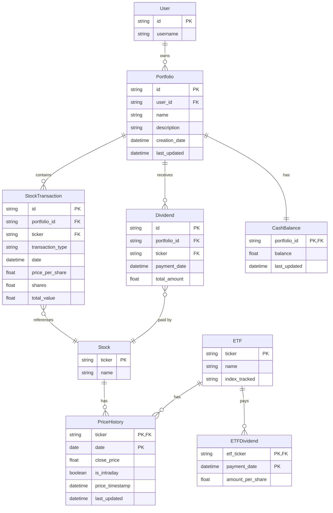

# MyStockTrackerApp - Data Model Diagram

## 1. Overview

This document provides a comprehensive data model for the MyStockTrackerApp, showing the relationships between entities and the structure of the database schema. The application uses SQLite for data storage with CSV backups for redundancy.

The data model is designed to support:
- Portfolio management with multiple portfolios
- Transaction-level tracking of stock purchases and sales
- Fractional share support
- Dividend tracking
- Historical price caching to minimize API calls
- Cash balance management within portfolios
- ETF comparison data

## 2. Entity Relationship Diagram



## 3. Entity Details

### 3.1 User

The User entity represents a single user of the application. In the initial implementation, the system will support a single user only, with multi-user functionality planned for later phases.

| Field | Type | Constraints | Description |
|-------|------|-------------|-------------|
| id | TEXT | PRIMARY KEY | Unique identifier |
| username | TEXT | NOT NULL | Username for display purposes |

### 3.2 Portfolio

A Portfolio represents a collection of stock transactions and dividends. Each user can have multiple portfolios.

| Field | Type | Constraints | Description |
|-------|------|-------------|-------------|
| id | TEXT | PRIMARY KEY | Unique identifier |
| user_id | TEXT | FOREIGN KEY | Reference to User |
| name | TEXT | NOT NULL | Portfolio name |
| description | TEXT | | Portfolio description |
| creation_date | DATETIME | NOT NULL | When the portfolio was created |
| last_updated | DATETIME | NOT NULL | When the portfolio was last modified |

### 3.3 StockTransaction

StockTransaction records represent individual stock purchases and sales, supporting fractional shares.

| Field | Type | Constraints | Description |
|-------|------|-------------|-------------|
| id | TEXT | PRIMARY KEY | Unique identifier |
| portfolio_id | TEXT | FOREIGN KEY | Reference to Portfolio |
| ticker | TEXT | FOREIGN KEY | Stock ticker symbol |
| transaction_type | TEXT | NOT NULL | "BUY" or "SELL" |
| date | DATETIME | NOT NULL | Transaction date |
| price_per_share | REAL | NOT NULL | Price at time of transaction |
| shares | REAL | NOT NULL | Number of shares (supports fractional) |
| total_value | REAL | NOT NULL | Total transaction value |

### 3.4 Dividend

Dividend records represent dividend payments received for stocks.

| Field | Type | Constraints | Description |
|-------|------|-------------|-------------|
| id | TEXT | PRIMARY KEY | Unique identifier |
| portfolio_id | TEXT | FOREIGN KEY | Reference to Portfolio |
| ticker | TEXT | FOREIGN KEY | Stock ticker symbol |
| payment_date | DATETIME | NOT NULL | When the dividend was paid |
| total_amount | REAL | NOT NULL | Total dividend amount |

### 3.5 CashBalance

CashBalance tracks the cash available in each portfolio from stock sales and dividends.

| Field | Type | Constraints | Description |
|-------|------|-------------|-------------|
| portfolio_id | TEXT | PRIMARY KEY, FOREIGN KEY | Reference to Portfolio |
| balance | REAL | NOT NULL | Current cash balance |
| last_updated | DATETIME | NOT NULL | When the balance was last updated |

### 3.6 Stock

The Stock entity represents basic information about a stock.

| Field | Type | Constraints | Description |
|-------|------|-------------|-------------|
| ticker | TEXT | PRIMARY KEY | Stock ticker symbol |
| name | TEXT | | Company name |
| sector | TEXT | | Business sector |

### 3.7 ETF

The ETF entity represents benchmark ETFs (VOO and QQQ).

| Field | Type | Constraints | Description |
|-------|------|-------------|-------------|
| ticker | TEXT | PRIMARY KEY | ETF ticker symbol |
| name | TEXT | NOT NULL | ETF name |
| index_tracked | TEXT | NOT NULL | Index that the ETF tracks |

### 3.8 PriceHistory

PriceHistory stores historical price data for both stocks and ETFs to minimize API calls.

| Field | Type | Constraints | Description |
|-------|------|-------------|-------------|
| ticker | TEXT | PRIMARY KEY (part 1), FOREIGN KEY | Stock or ETF ticker |
| date | DATE | PRIMARY KEY (part 2) | Price date |
| close_price | REAL | NOT NULL | Closing price |
| is_intraday | BOOLEAN | NOT NULL | Whether this is an intraday price |
| price_timestamp | DATETIME | NOT NULL | Exact timestamp of the price data |
| last_updated | DATETIME | NOT NULL | When this record was last fetched |

### 3.9 ETFDividend

ETFDividend tracks dividends paid by the benchmark ETFs.

| Field | Type | Constraints | Description |
|-------|------|-------------|-------------|
| etf_ticker | TEXT | PRIMARY KEY (part 1), FOREIGN KEY | ETF ticker symbol |
| payment_date | DATETIME | PRIMARY KEY (part 2) | Dividend payment date |
| amount_per_share | REAL | NOT NULL | Dividend amount per share |

## 4. Key Relationships

### 4.1 User to Portfolio (1:Many)
- A single user can own multiple portfolios
- Each portfolio belongs to exactly one user

### 4.2 Portfolio to StockTransaction (1:Many)
- A portfolio can contain multiple stock transactions
- Each transaction belongs to exactly one portfolio

### 4.3 Portfolio to Dividend (1:Many)
- A portfolio can receive multiple dividend payments
- Each dividend payment belongs to exactly one portfolio

### 4.4 Portfolio to CashBalance (1:1)
- Each portfolio has exactly one cash balance record
- Each cash balance record belongs to exactly one portfolio

### 4.5 Stock to PriceHistory (1:Many)
- Each stock has multiple price history records (one per day)
- Each price history record belongs to one stock

### 4.6 ETF to PriceHistory (1:Many)
- Each ETF has multiple price history records (one per day)
- Each price history record belongs to one ETF

### 4.7 ETF to ETFDividend (1:Many)
- Each ETF may pay multiple dividends
- Each ETF dividend belongs to one ETF

## 5. Optimizations

### 5.1 Price History Caching

The PriceHistory table is optimized for:
- Storing only closing prices as required
- Tracking whether a price is intraday or closing
- Including timestamps for data freshness evaluation
- Efficiently querying historical price data for performance calculations

### 5.2 Fractional Shares Support

All numeric fields in the database that relate to share quantities use REAL data types to properly support fractional shares.

### 5.3 Indexing Strategy

The following indexes will improve query performance:

1. Index on StockTransaction(portfolio_id, date) for retrieving transactions within date ranges
2. Index on Dividend(portfolio_id, payment_date) for calculating dividend returns
3. Index on PriceHistory(ticker, date) for rapid historical price lookups
4. Index on StockTransaction(ticker, portfolio_id) for retrieving all transactions for a specific stock

## 6. Data Persistence Strategy

### 6.1 SQLite Implementation

The data model will be implemented as a SQLite database with the tables and relationships defined above. SQLite provides a lightweight, file-based database solution that meets the requirements of a single-user application while minimizing resource usage.

### 6.2 CSV Backup

In addition to the SQLite database, the application will maintain CSV backups of critical data:

1. **Immediate Transaction Backup**: Each time a transaction or dividend is added, the data is immediately written to CSV files
2. **Portfolio Data Backup**: Portfolio metadata is backed up daily
3. **Price History Backup**: Price history data is backed up weekly

### 6.3 Data Import/Export

The data model supports:
- Importing transactions from CSV files
- Exporting portfolio data to CSV for external analysis
- Importing historical price data from external sources

## 7. Implementation Considerations

### 7.1 SQLite Initialization

The database will be initialized with the following SQL script:

```sql
-- Initialize User table
CREATE TABLE IF NOT EXISTS users (
    id TEXT PRIMARY KEY,
    username TEXT NOT NULL
);

-- Initialize Portfolio table
CREATE TABLE IF NOT EXISTS portfolios (
    id TEXT PRIMARY KEY,
    user_id TEXT NOT NULL,
    name TEXT NOT NULL,
    description TEXT,
    creation_date TEXT NOT NULL,
    last_updated TEXT NOT NULL,
    FOREIGN KEY (user_id) REFERENCES users(id)
);

-- Initialize StockTransaction table
CREATE TABLE IF NOT EXISTS transactions (
    id TEXT PRIMARY KEY,
    portfolio_id TEXT NOT NULL,
    ticker TEXT NOT NULL,
    transaction_type TEXT NOT NULL,
    date TEXT NOT NULL,
    price_per_share REAL NOT NULL,
    shares REAL NOT NULL,
    total_value REAL NOT NULL,
    FOREIGN KEY (portfolio_id) REFERENCES portfolios(id)
);

-- Initialize Dividend table
CREATE TABLE IF NOT EXISTS dividends (
    id TEXT PRIMARY KEY,
    portfolio_id TEXT NOT NULL,
    ticker TEXT NOT NULL,
    payment_date TEXT NOT NULL,
    total_amount REAL NOT NULL,
    FOREIGN KEY (portfolio_id) REFERENCES portfolios(id)
);

-- Initialize CashBalance table
CREATE TABLE IF NOT EXISTS cash_balances (
    portfolio_id TEXT PRIMARY KEY,
    balance REAL NOT NULL,
    last_updated TEXT NOT NULL,
    FOREIGN KEY (portfolio_id) REFERENCES portfolios(id)
);

-- Initialize Stock table
CREATE TABLE IF NOT EXISTS stocks (
    ticker TEXT PRIMARY KEY,
    name TEXT,
    sector TEXT
);

-- Initialize ETF table
CREATE TABLE IF NOT EXISTS etfs (
    ticker TEXT PRIMARY KEY,
    name TEXT NOT NULL,
    index_tracked TEXT NOT NULL
);

-- Initialize PriceHistory table
CREATE TABLE IF NOT EXISTS price_history (
    ticker TEXT,
    date TEXT,
    close_price REAL NOT NULL,
    is_intraday BOOLEAN NOT NULL,
    price_timestamp TEXT NOT NULL,
    last_updated TEXT NOT NULL,
    PRIMARY KEY (ticker, date)
);

-- Initialize ETFDividend table
CREATE TABLE IF NOT EXISTS etf_dividends (
    etf_ticker TEXT,
    payment_date TEXT,
    amount_per_share REAL NOT NULL,
    PRIMARY KEY (etf_ticker, payment_date),
    FOREIGN KEY (etf_ticker) REFERENCES etfs(ticker)
);

-- Create indexes for performance
CREATE INDEX IF NOT EXISTS idx_transactions_portfolio_date ON transactions(portfolio_id, date);
CREATE INDEX IF NOT EXISTS idx_dividends_portfolio_date ON dividends(portfolio_id, payment_date);
CREATE INDEX IF NOT EXISTS idx_price_history_ticker_date ON price_history(ticker, date);
CREATE INDEX IF NOT EXISTS idx_transactions_ticker_portfolio ON transactions(ticker, portfolio_id);
```

### 7.2 Default Data

The system will be initialized with the following default data:

1. A default user
2. A "Main" portfolio
3. ETF records for VOO and QQQ with their respective index information

### 7.3 Data Validation

Before inserting data into the database, the application will perform validation:

1. Ticker symbols will be validated against the Yahoo Finance API
2. Dates will be validated to ensure they're not in the future
3. Share quantities will be validated to ensure they're positive
4. Prices will be validated to ensure they're positive
5. Sale transactions will be validated to ensure sufficient shares are owned

## 8. Conclusion

This data model provides a complete and efficient structure for storing all application data. The design balances simplicity with functionality, supporting the core requirements while minimizing resource usage.

The model fulfills the key requirements:
1. Support for tracking individual stock transactions (not just positions)
2. Full support for fractional shares
3. Dividend tracking
4. Efficient price history caching
5. Portfolio comparison against benchmark ETFs
6. Cash balance management within portfolios