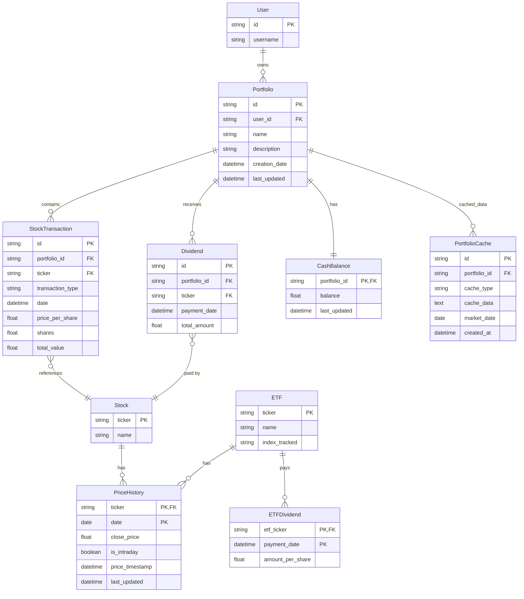

# MyStockTrackerApp - Data Model Diagram (Updated)
*Updated: June 22, 2025*

## 1. Overview

This document provides a comprehensive data model for the MyStockTrackerApp, showing the relationships between entities and the structure of the database schema. The application uses SQLite for data storage with intelligent caching for performance optimization.

The data model is designed to support:
- Portfolio management with multiple portfolios
- Transaction-level tracking of stock purchases and sales
- Fractional share support
- Dividend tracking
- Historical price caching to minimize API calls
- Cash balance management within portfolios
- ETF comparison data
- **✅ NEW**: Intelligent portfolio calculation caching for performance optimization

## 2. Entity Relationship Diagram



## 3. Entity Details

### 3.1 User

The User entity represents a single user of the application. In the initial implementation, the system will support a single user only, with multi-user functionality planned for later phases.

| Field | Type | Constraints | Description |
|-------|------|-------------|-------------|
| id | TEXT | PRIMARY KEY | Unique identifier |
| username | TEXT | NOT NULL | Username for display purposes |

### 3.2 Portfolio

A Portfolio represents a collection of stock transactions and dividends. Each user can have multiple portfolios.

| Field | Type | Constraints | Description |
|-------|------|-------------|-------------|
| id | TEXT | PRIMARY KEY | Unique identifier |
| user_id | TEXT | FOREIGN KEY | Reference to User |
| name | TEXT | NOT NULL | Portfolio name |
| description | TEXT | | Portfolio description |
| creation_date | DATETIME | NOT NULL | When the portfolio was created |
| last_updated | DATETIME | NOT NULL | When the portfolio was last modified |

### 3.3 StockTransaction

StockTransaction records represent individual stock purchases and sales, supporting fractional shares.

| Field | Type | Constraints | Description |
|-------|------|-------------|-------------|
| id | TEXT | PRIMARY KEY | Unique identifier |
| portfolio_id | TEXT | FOREIGN KEY | Reference to Portfolio |
| ticker | TEXT | FOREIGN KEY | Stock ticker symbol |
| transaction_type | TEXT | NOT NULL | "BUY" or "SELL" |
| date | DATETIME | NOT NULL | Transaction date |
| price_per_share | REAL | NOT NULL | Price at time of transaction |
| shares | REAL | NOT NULL | Number of shares (supports fractional) |
| total_value | REAL | NOT NULL | Total transaction value |

### 3.4 Dividend

Dividend records represent dividend payments received for stocks.

| Field | Type | Constraints | Description |
|-------|------|-------------|-------------|
| id | TEXT | PRIMARY KEY | Unique identifier |
| portfolio_id | TEXT | FOREIGN KEY | Reference to Portfolio |
| ticker | TEXT | FOREIGN KEY | Stock ticker symbol |
| payment_date | DATETIME | NOT NULL | When the dividend was paid |
| total_amount | REAL | NOT NULL | Total dividend amount |

### 3.5 CashBalance

CashBalance tracks the cash available in each portfolio from stock sales and dividends.

| Field | Type | Constraints | Description |
|-------|------|-------------|-------------|
| portfolio_id | TEXT | PRIMARY KEY, FOREIGN KEY | Reference to Portfolio |
| balance | REAL | NOT NULL | Current cash balance |
| last_updated | DATETIME | NOT NULL | When the balance was last updated |

### 3.6 PortfolioCache ✅ NEW

**PortfolioCache stores computed portfolio statistics and chart data to optimize performance and minimize API calls.**

| Field | Type | Constraints | Description |
|-------|------|-------------|-------------|
| id | TEXT | PRIMARY KEY | Unique identifier |
| portfolio_id | TEXT | FOREIGN KEY | Reference to Portfolio |
| cache_type | TEXT | NOT NULL | Type of cached data ('stats', 'chart_data') |
| cache_data | TEXT | NOT NULL | JSON-serialized cached data |
| market_date | DATE | NOT NULL | Market date this cache represents |
| created_at | DATETIME | NOT NULL | When the cache was created |

**Cache Types:**
- **'stats'**: Portfolio statistics including daily performance, ETF comparisons, gain/loss calculations
- **'chart_data'**: Chart visualization data for portfolio performance over time

**Key Features:**
- **Market-Aware Caching**: Cache is tied to specific market dates for accuracy
- **JSON Storage**: Flexible storage of complex calculated data structures
- **Performance Optimization**: Eliminates redundant calculations during market closures
- **Daily Performance Data**: Caches "Today vs. the Market" calculations

### 3.7 Stock

The Stock entity represents basic information about a stock.

| Field | Type | Constraints | Description |
|-------|------|-------------|-------------|
| ticker | TEXT | PRIMARY KEY | Stock ticker symbol |
| name | TEXT | | Company name |
| sector | TEXT | | Business sector |

### 3.8 ETF

The ETF entity represents benchmark ETFs (VOO and QQQ).

| Field | Type | Constraints | Description |
|-------|------|-------------|-------------|
| ticker | TEXT | PRIMARY KEY | ETF ticker symbol |
| name | TEXT | NOT NULL | ETF name |
| index_tracked | TEXT | NOT NULL | Index that the ETF tracks |

### 3.9 PriceHistory

PriceHistory stores historical price data for both stocks and ETFs to minimize API calls.

| Field | Type | Constraints | Description |
|-------|------|-------------|-------------|
| ticker | TEXT | PRIMARY KEY (part 1), FOREIGN KEY | Stock or ETF ticker |
| date | DATE | PRIMARY KEY (part 2) | Price date |
| close_price | REAL | NOT NULL | Closing price |
| is_intraday | BOOLEAN | NOT NULL | Whether this is an intraday price |
| price_timestamp | DATETIME | NOT NULL | Exact timestamp of the price data |
| last_updated | DATETIME | NOT NULL | When this record was last fetched |

### 3.10 ETFDividend

ETFDividend tracks dividends paid by the benchmark ETFs.

| Field | Type | Constraints | Description |
|-------|------|-------------|-------------|
| etf_ticker | TEXT | PRIMARY KEY (part 1), FOREIGN KEY | ETF ticker symbol |
| payment_date | DATETIME | PRIMARY KEY (part 2) | Dividend payment date |
| amount_per_share | REAL | NOT NULL | Dividend amount per share |

## 4. Key Relationships

### 4.1 User to Portfolio (1:Many)
- A single user can own multiple portfolios
- Each portfolio belongs to exactly one user

### 4.2 Portfolio to StockTransaction (1:Many)
- A portfolio can contain multiple stock transactions
- Each transaction belongs to exactly one portfolio

### 4.3 Portfolio to Dividend (1:Many)
- A portfolio can receive multiple dividend payments
- Each dividend payment belongs to exactly one portfolio

### 4.4 Portfolio to CashBalance (1:1)
- Each portfolio has exactly one cash balance record
- Each cash balance record belongs to exactly one portfolio

### 4.5 Portfolio to PortfolioCache (1:Many) ✅ NEW
- Each portfolio can have multiple cache entries (different types and dates)
- Each cache entry belongs to exactly one portfolio
- Cache entries are differentiated by cache_type and market_date

### 4.6 Stock to PriceHistory (1:Many)
- Each stock has multiple price history records (one per day)
- Each price history record belongs to one stock

### 4.7 ETF to PriceHistory (1:Many)
- Each ETF has multiple price history records (one per day)
- Each price history record belongs to one ETF

### 4.8 ETF to ETFDividend (1:Many)
- Each ETF may pay multiple dividends
- Each ETF dividend belongs to one ETF

## 5. Optimizations

### 5.1 Price History Caching

The PriceHistory table is optimized for:
- Storing only closing prices as required
- Tracking whether a price is intraday or closing
- Including timestamps for data freshness evaluation
- Efficiently querying historical price data for performance calculations

### 5.2 Portfolio Calculation Caching ✅ NEW

The PortfolioCache table provides:
- **Market-Aware Caching**: Different cache entries for different market dates
- **Calculation Optimization**: Eliminates redundant portfolio statistics calculations
- **Daily Performance Caching**: Stores "Today vs. the Market" calculations
- **Chart Data Caching**: Pre-computed chart visualization data
- **Intelligent Invalidation**: Cache tied to market dates for automatic freshness

### 5.3 Fractional Shares Support

All numeric fields in the database that relate to share quantities use REAL data types to properly support fractional shares.

### 5.4 Indexing Strategy

The following indexes improve query performance:

1. Index on StockTransaction(portfolio_id, date) for retrieving transactions within date ranges
2. Index on Dividend(portfolio_id, payment_date) for calculating dividend returns
3. Index on PriceHistory(ticker, date) for rapid historical price lookups
4. Index on StockTransaction(ticker, portfolio_id) for retrieving all transactions for a specific stock
5. **✅ NEW**: Index on PortfolioCache(portfolio_id, cache_type, market_date) for efficient cache lookups

## 6. Data Persistence Strategy

### 6.1 SQLite Implementation

The data model is implemented as a SQLite database with the tables and relationships defined above. SQLite provides a lightweight, file-based database solution that meets the requirements of a single-user application while minimizing resource usage.

### 6.2 CSV Import/Export ✅ ENHANCED

The application provides comprehensive CSV functionality:

**Import Features:**
- **User-Friendly Format**: Intuitive column names (Ticker, Type, Date, Price, Shares, Amount)
- **BOM Handling**: Automatic UTF-8-sig encoding for Excel compatibility
- **Data Cleaning**: Automatic removal of currency symbols and formatting
- **Intelligent Validation**: Detailed error messages for specific failures
- **Toggle Interface**: Separate import modes for transactions vs dividends

**Export Features:**
- Portfolio data export to CSV for external analysis
- Transaction history export with all relevant fields
- Dividend history export for tax reporting

### 6.3 Intelligent Caching System ✅ NEW

**Market-Aware Caching:**
- Cache portfolio calculations during market closures
- Automatic cache invalidation based on market dates
- Separate caching for different data types (stats vs chart data)

**Performance Benefits:**
- Eliminates redundant API calls during market closures
- Pre-computed daily performance comparisons
- Faster dashboard loading through cached calculations

## 7. Implementation Considerations

### 7.1 SQLite Schema Updates ✅ NEW

The database includes the new PortfolioCache table:

```sql
-- PortfolioCache table for performance optimization
CREATE TABLE IF NOT EXISTS portfolio_cache (
    id TEXT PRIMARY KEY,
    portfolio_id TEXT NOT NULL,
    cache_type TEXT NOT NULL,
    cache_data TEXT NOT NULL,
    market_date DATE NOT NULL,
    created_at DATETIME DEFAULT CURRENT_TIMESTAMP,
    FOREIGN KEY (portfolio_id) REFERENCES portfolios(id)
);

-- Index for efficient cache lookups
CREATE INDEX IF NOT EXISTS idx_portfolio_cache_lookup 
ON portfolio_cache(portfolio_id, cache_type, market_date);
```

### 7.2 Cache Management

**Cache Types:**
- **'stats'**: Portfolio statistics, daily performance, ETF comparisons
- **'chart_data'**: Pre-computed chart visualization data

**Cache Lifecycle:**
- Created during market closures for performance
- Invalidated when market reopens or new transactions added
- Automatically cleaned up for old market dates

### 7.3 Data Validation ✅ ENHANCED

Enhanced validation includes:
1. **CSV Import Validation**: Comprehensive validation with detailed error reporting
2. **Date Validation**: Ensures dates are valid and not in the future
3. **Ticker Validation**: Validates against available price data
4. **Transaction Validation**: Ensures sufficient shares for sales
5. **Cache Validation**: Ensures cache data integrity and freshness

## 8. Recent Enhancements ✅ NEW

### 8.1 Daily Performance Tracking
- **Market Intelligence**: Automatic detection of trading days vs holidays
- **ETF Comparison**: Real-time comparison with portfolio-equivalent ETF values
- **Holiday Handling**: Intelligent handling of market closures (e.g., Juneteenth)

### 8.2 CSV System Improvements
- **User Experience**: Toggle interface for transaction vs dividend imports
- **Data Processing**: BOM handling, currency symbol removal, date format conversion
- **Error Handling**: Specific validation messages with actionable feedback

### 8.3 Performance Optimization
- **Intelligent Caching**: Market-aware caching system for optimal performance
- **API Efficiency**: Minimized external API calls through strategic caching
- **Database Optimization**: Efficient queries and indexing strategies

## 9. Conclusion

This updated data model provides a complete and efficient structure for storing all application data, including the new performance optimization features. The design balances simplicity with functionality, supporting advanced features while maintaining excellent performance.

**Key Improvements:**
- ✅ **PortfolioCache Model**: Intelligent caching for performance optimization
- ✅ **Enhanced CSV System**: User-friendly import/export with comprehensive validation
- ✅ **Daily Performance Tracking**: Market-aware daily performance comparisons
- ✅ **Production Ready**: Comprehensive error handling and data validation

The model now fulfills all requirements including advanced features that exceed the original specification:
1. Support for tracking individual stock transactions with fractional shares
2. Comprehensive dividend tracking and reporting
3. Intelligent price history caching with market awareness
4. Advanced portfolio comparison against benchmark ETFs
5. **NEW**: Daily performance tracking with holiday intelligence
6. **NEW**: Performance-optimized caching system
7. **NEW**: Production-ready CSV import/export system