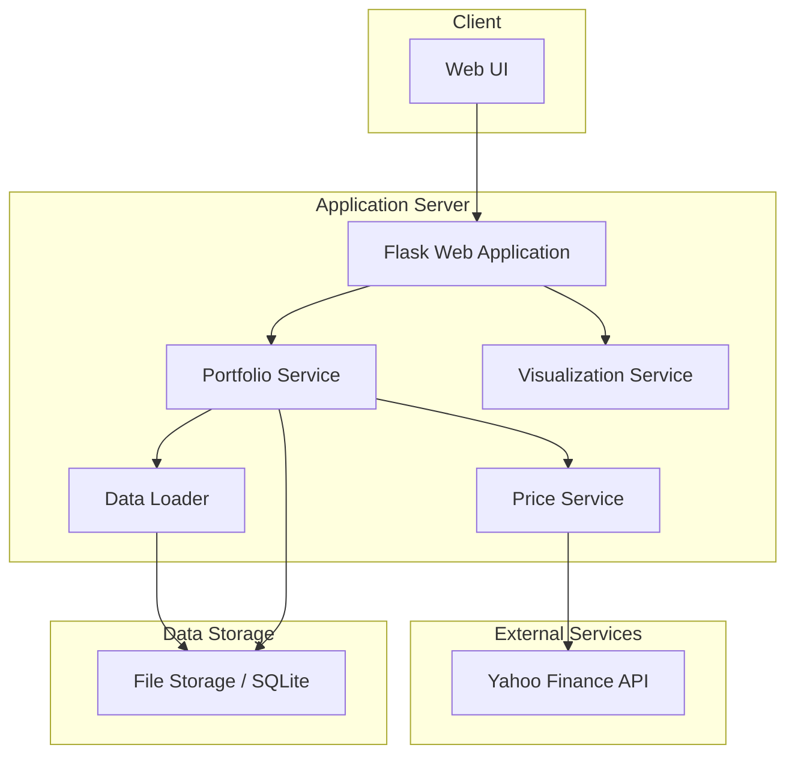

# MyStockTrackerApp - High-Level Design Document

## 1. Executive Summary

MyStockTrackerApp is a web application designed to help investors track the performance of their stock purchases against major market ETFs. The system allows users to manually enter stock purchases, sales, and dividends, organize them into multiple portfolios, and visualize performance comparisons against benchmark ETFs (VOO for S&P 500, QQQ for NASDAQ).

A key differentiator of this application is that, in addition to portfolio performance, we're tracking the performance of individual stock transactions. This is subtly different from the performance of specific stocks. Most other applications don't take into account the fact that a position in a specific stock is generally established over time with a series of purchases that may stretch over weeks, months or even years.

This document outlines the high-level technical design for implementing the application with a focus on cost efficiency while maintaining functionality. The design prioritizes a mobile-first approach while ensuring desktop compatibility. The implementation leverages Python, free APIs, and Heroku's free tier to minimize costs during the initial deployment phase.

## 2. Strategic Context

### 2.1 Current Limitations and Pain Points

Currently, investors face several challenges when tracking their portfolio performance:
- Difficulty comparing individual stock performance against market benchmarks
- Limited visualization of portfolio performance data
- Challenges in understanding performance across different investment time periods
- Lack of mobile-friendly tools for tracking investments on the go

### 2.2 Business Drivers

The MyStockTrackerApp addresses these pain points by providing:
- Clear performance comparisons between user investments and market benchmarks
- Multiple visualization methods for understanding portfolio performance
- Age-based analysis of investment performance
- Mobile-first design for convenient access

## 3. Technical Architecture

### 3.1 System Architecture Overview

The MyStockTrackerApp will follow a lightweight three-tier architecture:

1. **Presentation Layer**: Mobile-optimized web interface
2. **Application Layer**: Python-based backend services
3. **Data Layer**: Simple file-based or lightweight database storage

This architecture provides a balance between functionality and cost-efficiency, with components designed to function within Heroku's free tier constraints.

### 3.2 Key Components

#### 3.2.1 Web Application (Frontend)

The frontend will be implemented as a responsive web application using HTML, CSS, and JavaScript with a focus on mobile-first design. Key considerations:

- **Responsive Framework**: A lightweight framework like Bootstrap or Tailwind CSS to ensure responsive design across mobile and desktop
- **Visualization Library**: Chart.js or D3.js for implementing the required visualizations
- **Minimal JavaScript**: Keep client-side processing to a minimum to improve performance on mobile devices
- **Progressive Enhancement**: Ensure core functionality works even with limited JavaScript support

#### 3.2.2 Backend Services

The backend will be implemented in Python, with the following components:

1. **Flask Web Application**:
   - Handles HTTP requests and responses
   - Manages user sessions
   - Renders templates or serves API responses

2. **Portfolio Service**:
   - Manages portfolio data
   - Calculates performance metrics
   - Compares portfolio performance against ETFs

3. **Price Service**:
   - Retrieves real-time and historical stock prices
   - Caches price data to minimize API calls
   - Manages ETF price data for comparison

4. **Data Loader**:
   - Handles data import/export
   - Manages persistence of user data
   - Performs data validation

5. **Visualization Service**:
   - Prepares data for various visualizations
   - Generates visualization configurations

#### 3.2.3 Data Storage

To minimize costs and complexity, the initial implementation will use a simple storage approach:

- **SQLite Database**: Lightweight, file-based database requiring minimal resources
- **CSV File Backup**: Periodic export of data to CSV files as a backup mechanism
- **Data Caching**: In-memory caching of frequently accessed data to reduce database load

#### 3.2.4 External Interfaces

The primary external interface is the Yahoo Finance API, which will be used to:
- Retrieve real-time stock prices during market hours
- Access historical price data for performance tracking
- Obtain ETF (VOO, QQQ) price data for benchmark comparisons

### 3.3 Data Model

The application will use the following data model:

1. **User**:
   - UserID (unique identifier)
   - Username
   - Note: Initially implemented as a single-user application, with multi-user authentication planned for later phases

2. **Portfolio**:
   - PortfolioID (unique identifier)
   - UserID (reference to User)
   - Name
   - Description
   - Creation date

3. **StockTransaction**:
   - TransactionID (unique identifier)
   - PortfolioID (reference to Portfolio)
   - TransactionType (Purchase, Sale)
   - Ticker symbol
   - Date
   - Price per share
   - Number of shares
   - Total value

4. **Dividend**:
   - DividendID (unique identifier)
   - PortfolioID (reference to Portfolio)
   - Ticker symbol
   - Payment date
   - Amount per share
   - Number of shares
   - Total amount

5. **PriceHistory**:
   - Ticker symbol
   - Date
   - Open price
   - Close price
   - High price
   - Low price
   - Volume
   - Last updated timestamp

## 4. Implementation Strategy

### 4.1 Development Approach

The implementation will follow an incremental approach with frequent deployments:

1. **Phase 1: Core Functionality**
   - Setup project structure and environment
   - Implement data model and storage
   - Create Yahoo Finance API integration
   - Develop basic portfolio management functionality
   - Implement the portfolio performance chart

2. **Phase 2: Basic Visualizations**
   - Implement investment & gains stacked bar chart
   - Develop detailed portfolio table with sorting and filtering
   - Create performance distribution bar chart

3. **Phase 3: Advanced Features**
   - Implement age-based performance pie charts
   - Develop investment and gain distribution heatmaps
   - Add dividend tracking and integration into performance metrics
   - Enhance filtering and sorting capabilities

### 4.2 Technology Stack Details

#### Backend:
- **Language**: Python 3.x
- **Web Framework**: Flask (lightweight, suitable for Heroku free tier)
- **Data Access**: SQLAlchemy (for database abstraction)
- **API Integration**: requests or yfinance library for Yahoo Finance API integration

#### Frontend:
- **HTML/CSS Framework**: Bootstrap (responsive, mobile-first)
- **JavaScript Libraries**:
  - Chart.js for standard charts (line, bar, pie)
  - D3.js for advanced visualizations (heatmaps)
  - Lightweight data table library for the portfolio table

#### Database:
- SQLite (file-based, minimal resource requirements)

#### Development Environment:
- Claude Code with Visual Studio Code for AI-assisted development
- GitHub repository for version control

#### Deployment:
- Heroku free tier
- Git-based deployment workflow

### 4.3 Performance Optimization Strategies

Given the constraint to minimize hosting costs, the following optimization strategies will be employed:

1. **Server-side Rendering**: Minimize client-side processing
2. **Data Caching**: Cache stock price data to reduce API calls
3. **Lazy Loading**: Load visualizations only when needed
4. **Compact Data Storage**: Optimize data storage formats
5. **Request Batching**: Batch API requests to reduce calls
6. **Efficient Queries**: Optimize database queries

### 4.4 Mobile Optimization

Since the primary use case is on mobile devices:

1. **Touch-Friendly UI**: Larger touch targets for buttons and controls
2. **Simplified Views**: Streamlined interface on smaller screens
3. **Progressive Loading**: Load essential content first
4. **Responsive Tables**: Mobile-optimized table views with horizontal scrolling or collapsible rows
5. **Gesture Support**: Implement touch gestures for common actions

## 5. Operational Considerations

### 5.1 Deployment Strategy

The application will be deployed on Heroku's free tier with the following considerations:

1. **Dyno Sleeping**: The application will sleep after 30 minutes of inactivity (Heroku free tier limitation)
2. **Cold Start Handling**: Implement strategies to minimize impact of cold starts
3. **Database Limitations**: Work within SQLite constraints and Heroku's ephemeral filesystem

### 5.2 Data Management

1. **Backup Strategy**:
   - Regular export of user data to CSV files
   - Option for users to manually export their portfolio data

2. **Price Data Management**:
   - Cache price data with timestamps
   - Implement refresh policies to balance between API call limits and data freshness

### 5.3 Error Handling and Monitoring

1. **Error Logging**:
   - Implement structured logging
   - Track API failures and retries

2. **Monitoring**:
   - Basic application health monitoring
   - API usage tracking to avoid hitting rate limits

### 5.4 Security Considerations

1. **Data Protection**:
   - Input validation and sanitization
   - Protection against common web vulnerabilities

2. **Authentication** (for future multi-user support):
   - Secure password storage
   - Session management

## 6. Alternatives Analysis

### 6.1 Backend Alternatives

1. **Django vs. Flask**:
   - Django provides more built-in functionality but has higher resource requirements
   - Flask is lighter weight and better suited for Heroku free tier
   - Decision: Flask chosen for its minimal footprint and lower resource requirements

2. **Database Options**:
   - PostgreSQL (Heroku add-on, but requires paid tier)
   - MongoDB (requires paid service)
   - SQLite (file-based, minimal resources)
   - Decision: SQLite chosen for simplicity and zero additional cost

### 6.2 Stock Data API Alternatives

1. **Alpha Vantage vs. Yahoo Finance**:
   - Alpha Vantage has stricter API limits on free tier
   - Yahoo Finance offers more data points without registration
   - Decision: Yahoo Finance API chosen for better free tier limits

### 6.3 Hosting Alternatives

1. **AWS vs. Heroku**:
   - AWS offers more flexibility but requires more configuration
   - Heroku provides simpler deployment but has stricter free tier limitations
   - Decision: Heroku chosen for simplicity of deployment and management

## 7. Success Metrics

The success of the MyStockTrackerApp implementation will be measured by:

1. **Functional Completeness**:
   - All required visualizations implemented
   - Accurate performance calculations
   - Complete portfolio management functionality

2. **User Experience**:
   - Mobile responsiveness and usability
   - Chart rendering performance
   - Intuitive navigation between portfolios

3. **Technical Performance**:
   - Staying within Heroku free tier limits
   - Minimizing API call failures
   - Maintaining acceptable page load times within cost constraints

## 8. Conclusion

This high-level design provides a blueprint for implementing the MyStockTrackerApp with a focus on mobile-first design and cost efficiency. The design leverages lightweight technologies and optimized data handling to deliver the required functionality within the constraints of free-tier services. The phased implementation approach allows for delivering core functionality first, with progressive enhancement of features over time.

The architecture balances technical constraints with user requirements, prioritizing essential features while providing a foundation that can scale to support future enhancements such as multi-user functionality and additional visualization options.