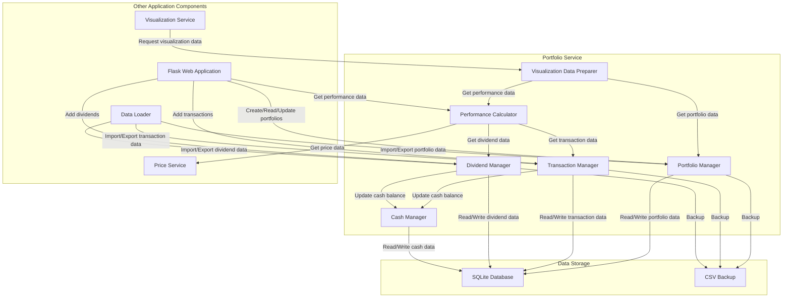

# MyStockTrackerApp - Portfolio Service Component Design

## 1. Overview

The Portfolio Service is a core component of the MyStockTrackerApp responsible for managing user portfolios, stock transactions, dividends, and performance calculations. This document provides a detailed design for the Portfolio Service, focusing on transaction management, performance calculation, and integration with other system components.

## 2. Design Goals

The Portfolio Service is designed with the following primary goals:

1. **Accurate Performance Tracking**: Calculate performance metrics for individual stock transactions, not just overall positions
2. **Benchmark Comparisons**: Compare portfolio and stock performance against market ETFs
3. **Fractional Share Support**: Handle fractional shares in all calculations and transactions
4. **Visualization Data Preparation**: Prepare data for various visualizations
5. **Efficient Data Management**: Maintain portfolio data with minimal resource usage
6. **Transaction History**: Track the complete history of stock purchases, sales, and dividends

## 3. Component Architecture

### 3.1 Component Diagram



### 3.2 Component Responsibilities

#### Portfolio Manager
- Manages CRUD operations for portfolios
- Maintains portfolio metadata (name, description, creation date)
- Provides portfolio listing and summary data
- Handles portfolio switching

#### Transaction Manager
- Processes stock purchases and sales
- Validates transaction data
- Manages transaction history
- Supports fractional shares in transactions
- Maintains current holdings information

#### Dividend Manager
- Processes dividend entries
- Validates dividend data
- Manages dividend history
- Calculates dividend totals and yields

#### Performance Calculator
- Calculates individual transaction performance
- Calculates overall portfolio performance
- Compares performance against benchmark ETFs
- Supports various time periods (day, week, month, YTD, 1Y, 5Y, all)
- Handles age-based performance metrics

#### Visualization Data Preparer
- Transforms raw data into visualization-ready formats
- Prepares data for each visualization type
- Handles data aggregation for visualizations
- Optimizes data structure for frontend rendering

#### Cash Manager
- Tracks cash balances within portfolios
- Handles cash from sales and dividends
- Allocates cash for new purchases
- Calculates cash component of portfolio value

## 4. Data Flow Scenarios

### 4.1 Adding a Stock Purchase

1. **User submits purchase details** via Web Application
2. **Web Application** forwards request to **Transaction Manager**
3. **Transaction Manager**:
   - Validates the transaction data (valid ticker, positive shares, etc.)
   - Checks with **Cash Manager** for available cash balance
   - If sufficient cash is available, uses it for the purchase
   - If insufficient cash is available, assumes user is adding new funds
   - Creates a new purchase transaction record
   - Updates the user's holdings
   - Instructs **Cash Manager** to update cash balance
4. **Transaction Manager** writes data to **SQLite Database**
5. **Web Application** confirms successful transaction to user

### 4.2 Adding a Dividend

1. **User submits dividend details** via Web Application
2. **Web Application** forwards request to **Dividend Manager**
3. **Dividend Manager**:
   - Validates the dividend data (valid ticker, positive amount, etc.)
   - Creates a new dividend record
   - Instructs **Cash Manager** to add dividend amount to cash balance
4. **Dividend Manager** writes data to **SQLite Database**
5. **Web Application** confirms successful dividend entry to user

### 4.3 Calculating Portfolio Performance

1. **Visualization Service** requests portfolio performance data
2. **Performance Calculator**:
   - Retrieves all transactions via **Transaction Manager**
   - Retrieves all dividends via **Dividend Manager**
   - Requests historical price data from **Price Service** for both stocks and ETFs
   - Calculates performance for each transaction
   - Calculates equivalent ETF performance for comparison
   - Aggregates results for overall portfolio performance
3. **Performance Calculator** returns performance data
4. **Visualization Data Preparer** formats data for specific visualization
5. **Visualization Service** renders the visualization

### 4.4 Switching Between Portfolios

1. **User selects a different portfolio** via Web Application
2. **Web Application** requests portfolio change from **Portfolio Manager**
3. **Portfolio Manager**:
   - Loads the selected portfolio data
   - Notifies other components of context change
4. **Transaction Manager**, **Dividend Manager**, and **Cash Manager** load data for the new portfolio
5. **Web Application** updates UI to show the selected portfolio

## 5. Transaction and Performance Calculation Logic

### 5.1 Transaction Model

The core transaction data model includes:

```python
class StockTransaction:
    id: str  # Unique identifier
    portfolio_id: str  # Reference to parent portfolio
    transaction_type: str  # "BUY" or "SELL"
    ticker: str  # Stock ticker symbol
    date: datetime  # Transaction date
    price_per_share: float  # Price at time of transaction
    shares: float  # Number of shares (supports fractional)
    total_value: float  # Total transaction value
```

### 5.2 Dividend Model

The dividend data model includes:

```python
class Dividend:
    id: str  # Unique identifier
    portfolio_id: str  # Reference to parent portfolio
    ticker: str  # Stock ticker symbol
    payment_date: datetime  # Dividend payment date
    total_amount: float  # Total dividend amount
```

### 5.3 Performance Calculation Algorithm

The performance calculation logic will focus on two main scenarios:
1. **Market is Open**: Use the latest available price
2. **Market is Closed**: Use the most recent closing price

In both cases, we're essentially using the most recent price available.

1. **For each stock purchase**:
   - Retrieve purchase price and date
   - Retrieve most recent price available
   - Calculate gain/loss percentage using Internal Rate of Return (IRR) to account for dividends
   - Calculate absolute gain/loss: (current_price - purchase_price) * shares + dividends

2. **For ETF comparison**:
   - Determine ETF price (closing price) on purchase date
   - Determine most recent ETF price available
   - Include ETF dividends in calculations (to be added to requirements)
   - Calculate hypothetical ETF IRR including dividends
   - Calculate relative performance: stock_IRR - etf_IRR

3. **For portfolio performance**:
   - Calculate weighted average of individual stock performances
   - Include dividend income in total returns
   - Calculate time-weighted return to account for cash flows
   - Compare against hypothetical ETF investments made on the same dates with the same amounts

4. **For age-based analysis**:
   - Group transactions by age category
   - Calculate performance metrics for each group
   - Determine proportion beating vs. trailing the benchmark
### 5.4 Dividend Handling in Performance Calculations

The accurate handling of dividends is crucial for proper performance evaluation. The Portfolio Service implements a comprehensive approach to incorporating dividends into performance calculations:

#### 5.4.1 Individual Transaction-Level Dividend Integration

For individual stock transactions, dividends affect performance calculations as follows:

1. **Attributing Dividends to Transactions**: 
   - When a dividend is received, it is proportionally attributed to all active transactions for that ticker based on the number of shares held at the time of dividend payment
   - For a specific transaction: `attributed_dividend = (transaction_shares / total_ticker_shares) * total_dividend_amount`

2. **Internal Rate of Return (IRR) Calculation**:
   - The IRR calculation for individual transactions incorporates both:
     - The initial cash outflow (negative value) at purchase date
     - Any attributed dividends as cash inflows (positive values) at dividend payment dates
     - The current value as the final cash inflow (positive value) at calculation date
   
   ```python
   def calculate_transaction_irr(purchase_price, purchase_date, attributed_dividends, current_price, calculation_date):
       """
       Calculate IRR for an individual transaction including dividends.
       
       Args:
           purchase_price: Initial investment amount (negative value)
           purchase_date: Date of purchase
           attributed_dividends: List of (date, amount) tuples for dividends
           current_price: Current value of the investment
           calculation_date: Date of calculation
           
       Returns:
           IRR as an annualized percentage
       """
       # Create cash flow timeline
       cashflows = [(purchase_date, -purchase_price)]
       
       # Add dividend cash flows
       for div_date, div_amount in attributed_dividends:
           cashflows.append((div_date, div_amount))
           
       # Add current value as final cash flow
       cashflows.append((calculation_date, current_price))
       
       # Sort cash flows by date
       cashflows.sort(key=lambda x: x[0])
       
       # Calculate IRR using numpy's financial functions
       dates = [cf[0] for cf in cashflows]
       amounts = [cf[1] for cf in cashflows]
       days_between = [(date - dates[0]).days for date in dates]
       
       # Use numpy to calculate IRR
       irr_daily = npf.irr(amounts)
       
       # Convert to annualized rate
       irr_annual = (1 + irr_daily) ** 365 - 1
       
       return irr_annual * 100  # Return as percentage
   ```

3. **Performance Visualization**:
   - In transaction-level displays, attributed dividends are shown separately and included in the total return
   - Visual indication distinguishes between price appreciation and dividend income

#### 5.4.2 Portfolio-Level Dividend Integration

For overall portfolio performance:

1. **Aggregate Dividend Handling**:
   - All dividends are included as cash inflows at their payment dates
   - Cash balances resulting from dividends are tracked by the Cash Manager
   - Reinvestment of dividends (through new purchases) is captured via standard transaction tracking

2. **Portfolio IRR Calculation**:
   - The portfolio IRR calculation includes:
     - Initial investments as cash outflows
     - All dividends as cash inflows
     - All sales as cash inflows
     - All additional purchases as cash outflows
     - Current portfolio value as the final cash inflow

   ```python
   def calculate_portfolio_irr(portfolio_id, end_date=None):
       """
       Calculate IRR for the entire portfolio including dividends.
       
       Args:
           portfolio_id: The portfolio to calculate IRR for
           end_date: Optional end date for calculation (defaults to today)
           
       Returns:
           IRR as an annualized percentage
       """
       # Get all transactions
       transactions = get_all_transactions(portfolio_id)
       
       # Get all dividends
       dividends = get_all_dividends(portfolio_id)
       
       # Create cash flow timeline
       cashflows = []
       
       # Add purchase transactions (negative cash flows)
       for txn in transactions:
           if txn.transaction_type == "BUY":
               cashflows.append((txn.date, -txn.total_value))
           elif txn.transaction_type == "SELL":
               cashflows.append((txn.date, txn.total_value))
       
       # Add dividend cash flows
       for div in dividends:
           cashflows.append((div.payment_date, div.total_amount))
       
       # Calculate current portfolio value
       end_date = end_date or datetime.now().date()
       current_value = calculate_portfolio_value(portfolio_id, end_date)
       
       # Add current value as final cash flow
       cashflows.append((end_date, current_value))
       
       # Calculate IRR using numpy's financial functions
       # (Similar to transaction IRR calculation)
       dates = [cf[0] for cf in cashflows]
       amounts = [cf[1] for cf in cashflows]
       days_between = [(date - dates[0]).days for date in dates]
       
       # Use numpy to calculate IRR
       irr_daily = npf.irr(amounts)
       
       # Convert to annualized rate
       irr_annual = (1 + irr_daily) ** 365 - 1
       
       return irr_annual * 100  # Return as percentage
   ```

#### 5.4.3 ETF Comparison with Dividends

For accurate comparisons against benchmark ETFs:

1. **ETF Dividend Tracking**:
   - Historical ETF dividend data is retrieved from the Price Service
   - ETF dividends are processed similarly to stock dividends

2. **Equivalent ETF Investment Calculation**:
   - For each stock purchase, an equivalent ETF purchase is simulated:
     - Same dollar amount invested on the same date
     - ETF dividends received based on shares owned
     - Total return calculated including both price appreciation and dividend income

3. **Performance Comparison Logic**:
   ```python
   def compare_stock_vs_etf(stock_ticker, etf_ticker, purchase_date, purchase_amount):
       """
       Compare performance of a stock investment vs equivalent ETF investment.
       
       Args:
           stock_ticker: The stock to evaluate
           etf_ticker: The ETF to compare against
           purchase_date: Date of purchase
           purchase_amount: Amount invested
           
       Returns:
           Dictionary with performance metrics for both investments
       """
       # Get stock data
       stock_current_value = calculate_stock_current_value(stock_ticker, purchase_date, purchase_amount)
       stock_dividends = get_stock_dividends(stock_ticker, purchase_date, purchase_amount)
       stock_total_return = ((stock_current_value + sum(d['amount'] for d in stock_dividends)) / purchase_amount - 1) * 100
       
       # Get equivalent ETF data
       etf_current_value = calculate_etf_current_value(etf_ticker, purchase_date, purchase_amount)
       etf_dividends = get_etf_dividends(etf_ticker, purchase_date, purchase_amount)
       etf_total_return = ((etf_current_value + sum(d['amount'] for d in etf_dividends)) / purchase_amount - 1) * 100
       
       # Calculate performance difference
       return {
           "stock_ticker": stock_ticker,
           "stock_return": stock_total_return,
           "stock_price_return": (stock_current_value / purchase_amount - 1) * 100,
           "stock_dividend_return": sum(d['amount'] for d in stock_dividends) / purchase_amount * 100,
           
           "etf_ticker": etf_ticker,
           "etf_return": etf_total_return,
           "etf_price_return": (etf_current_value / purchase_amount - 1) * 100,
           "etf_dividend_return": sum(d['amount'] for d in etf_dividends) / purchase_amount * 100,
           
           "relative_performance": stock_total_return - etf_total_return
       }
   ```

This comprehensive approach ensures that dividend income is properly accounted for in all performance metrics and comparisons, providing users with accurate insights into how their investments are performing relative to benchmark ETFs on both price appreciation and total return basis.

## 6. Visualization Data Preparation

The Portfolio Service will prepare data for the following visualizations:

### 6.1 Portfolio Performance Chart

```python
def prepare_portfolio_performance_data(portfolio_id, start_date, end_date):
    # Collect daily portfolio values (including dividends)
    portfolio_values = calculate_daily_portfolio_values(portfolio_id, start_date, end_date)
    
    # Get ETF comparison data (VOO and QQQ) with dividends included
    voo_comparison = calculate_etf_comparison("VOO", portfolio_id, start_date, end_date)
    qqq_comparison = calculate_etf_comparison("QQQ", portfolio_id, start_date, end_date)
    
    # Format for visualization
    return {
        "dates": [date.strftime("%Y-%m-%d") for date in date_range],
        "portfolio": normalize_values(portfolio_values),
        "voo": normalize_values(voo_comparison),
        "qqq": normalize_values(qqq_comparison)
    }
```

### 6.2 Investment & Gains Stacked Bar Chart

```python
def prepare_stacked_bar_data(portfolio_id):
    # Calculate portfolio investment and gains
    portfolio_investment = calculate_total_investment(portfolio_id)
    portfolio_gains = calculate_total_gains(portfolio_id)
    portfolio_dividends = calculate_total_dividends(portfolio_id)
    
    # Calculate equivalent ETF investments and gains
    voo_investment = portfolio_investment
    voo_gains = calculate_etf_gains("VOO", portfolio_id)
    voo_dividends = calculate_etf_dividends("VOO", portfolio_id)
    
    qqq_investment = portfolio_investment
    qqq_gains = calculate_etf_gains("QQQ", portfolio_id)
    qqq_dividends = calculate_etf_dividends("QQQ", portfolio_id)
    
    return {
        "categories": ["Portfolio", "S&P 500 (VOO)", "NASDAQ (QQQ)"],
        "investments": [portfolio_investment, voo_investment, qqq_investment],
        "gains": [portfolio_gains, voo_gains, qqq_gains],
        "dividends": [portfolio_dividends, voo_dividends, qqq_dividends]
    }
```

### 6.3 Heatmap Data Preparation

```python
def prepare_investment_heatmap_data(portfolio_id):
    # Get current holdings grouped by ticker
    holdings = get_current_holdings(portfolio_id)
    
    # Calculate investment amount for each ticker
    investments = {}
    for ticker, shares in holdings.items():
        investments[ticker] = calculate_total_investment_for_ticker(portfolio_id, ticker)
    
    # Calculate proportional sizes
    total_investment = sum(investments.values())
    return [
        {
            "ticker": ticker,
            "value": investment,
            "proportion": investment / total_investment
        }
        for ticker, investment in investments.items()
    ]

def prepare_gain_heatmap_data(portfolio_id):
    # Get current holdings grouped by ticker
    holdings = get_current_holdings(portfolio_id)
    
    # Calculate gains for each ticker (including dividends)
    gains = {}
    for ticker, shares in holdings.items():
        ticker_gain = calculate_total_gains_for_ticker(portfolio_id, ticker)
        ticker_dividends = calculate_total_dividends_for_ticker(portfolio_id, ticker)
        if ticker_gain + ticker_dividends > 0:
            gains[ticker] = ticker_gain + ticker_dividends
    
    # Calculate proportional sizes
    total_gains = sum(gains.values())
    return [
        {
            "ticker": ticker,
            "value": gain,
            "proportion": gain / total_gains
        }
        for ticker, gain in gains.items()
    ]
```

## 7. Integration with Price Service

The Portfolio Service will rely heavily on the Price Service for price data. Key integration points include:

### 7.1 Price Data Retrieval

```python
def get_price_data(ticker, date):
    """
    Get the closing price for a ticker on a specific date.
    Uses the Price Service API.
    """
    return price_service.get_price(ticker, date)

def get_price_history(ticker, start_date, end_date):
    """
    Get historical price data for a ticker within a date range.
    Uses the Price Service API.
    """
    return price_service.get_price_history(ticker, start_date, end_date)
```

### 7.2 ETF Comparison Data

```python
def get_etf_comparison_data(etf_ticker, investment_date, investment_amount, current_date=None):
    """
    Calculate how an investment in an ETF would have performed.
    
    Args:
        etf_ticker: The ETF ticker (e.g., "VOO" or "QQQ")
        investment_date: When the investment would have been made
        investment_amount: How much would have been invested
        current_date: The date to calculate value (defaults to today)
    
    Returns:
        Dictionary with investment details and performance metrics
    """
    # Get ETF prices
    etf_purchase_price = price_service.get_price(etf_ticker, investment_date)
    etf_current_price = price_service.get_price(etf_ticker, current_date or datetime.now().date())
    
    # Calculate performance
    shares_purchased = investment_amount / etf_purchase_price
    current_value = shares_purchased * etf_current_price
    gain_loss = current_value - investment_amount
    gain_loss_percentage = (gain_loss / investment_amount) * 100
    
    return {
        "ticker": etf_ticker,
        "investment_date": investment_date,
        "investment_amount": investment_amount,
        "purchase_price": etf_purchase_price,
        "shares_purchased": shares_purchased,
        "current_price": etf_current_price,
        "current_value": current_value,
        "gain_loss": gain_loss,
        "gain_loss_percentage": gain_loss_percentage
    }
```

## 8. Cash Management

The Cash Manager component handles all cash-related operations within portfolios:

### 8.1 Cash Balance Tracking

```python
def update_cash_balance(portfolio_id, transaction_type, amount):
    """
    Update portfolio cash balance based on transaction type.
    
    Args:
        portfolio_id: The portfolio to update
        transaction_type: DEPOSIT, WITHDRAW, PURCHASE, SALE, DIVIDEND
        amount: The amount to add or subtract
    """
    current_balance = get_cash_balance(portfolio_id)
    
    if transaction_type in ["DEPOSIT", "SALE", "DIVIDEND"]:
        # Add to cash balance
        new_balance = current_balance + amount
    elif transaction_type in ["WITHDRAW", "PURCHASE"]:
        # Subtract from cash balance
        new_balance = current_balance - amount
        if new_balance < 0:
            raise InsufficientFundsError(f"Insufficient funds. Available: ${current_balance}")
    
    # Update in database
    update_balance_in_db(portfolio_id, new_balance)
    
    # Immediately persist to CSV backup
    backup_to_csv(portfolio_id)
    
    return new_balance
```

### 8.2 Cash Allocation for Purchases

```python
def allocate_cash_for_purchase(portfolio_id, purchase_amount):
    """
    Check if sufficient cash is available and allocate it for a purchase.
    
    Args:
        portfolio_id: The portfolio to check
        purchase_amount: The amount required for purchase
        
    Returns:
        True if allocation successful, False if insufficient funds
    """
    current_balance = get_cash_balance(portfolio_id)
    
    if current_balance >= purchase_amount:
        # Sufficient funds available
        return True
    else:
        # Insufficient funds
        return False
```

## 9. Data Persistence

The Portfolio Service will implement immediate persistence to both SQLite and CSV backup:

### 9.1 Database Operations

All portfolio, transaction, and dividend data will be stored in SQLite tables with the following schema:

```sql
-- Portfolio table
CREATE TABLE portfolios (
    id TEXT PRIMARY KEY,
    name TEXT NOT NULL,
    description TEXT,
    creation_date TEXT NOT NULL,
    last_updated TEXT NOT NULL
);

-- Transaction table
CREATE TABLE transactions (
    id TEXT PRIMARY KEY,
    portfolio_id TEXT NOT NULL,
    transaction_type TEXT NOT NULL,
    ticker TEXT NOT NULL,
    date TEXT NOT NULL,
    price_per_share REAL NOT NULL,
    shares REAL NOT NULL,
    total_value REAL NOT NULL,
    FOREIGN KEY (portfolio_id) REFERENCES portfolios(id)
);

-- Dividend table
CREATE TABLE dividends (
    id TEXT PRIMARY KEY,
    portfolio_id TEXT NOT NULL,
    ticker TEXT NOT NULL,
    payment_date TEXT NOT NULL,
    total_amount REAL NOT NULL,
    FOREIGN KEY (portfolio_id) REFERENCES portfolios(id)
);

-- Cash balance table
CREATE TABLE cash_balances (
    portfolio_id TEXT PRIMARY KEY,
    balance REAL NOT NULL,
    last_updated TEXT NOT NULL,
    FOREIGN KEY (portfolio_id) REFERENCES portfolios(id)
);
```

### 9.2 CSV Backup

Immediate CSV backup will be implemented for all transaction and dividend records:

```python
def backup_to_csv(portfolio_id):
    """
    Export portfolio data to CSV files.
    
    Args:
        portfolio_id: The portfolio to export
    """
    # Get data from database
    portfolio = get_portfolio(portfolio_id)
    transactions = get_transactions(portfolio_id)
    dividends = get_dividends(portfolio_id)
    cash_balance = get_cash_balance(portfolio_id)
    
    # Export to CSV files
    export_portfolio_to_csv(portfolio, f"portfolio_{portfolio_id}.csv")
    export_transactions_to_csv(transactions, f"transactions_{portfolio_id}.csv")
    export_dividends_to_csv(dividends, f"dividends_{portfolio_id}.csv")
    export_cash_balance_to_csv(cash_balance, f"cash_{portfolio_id}.csv")
```

## 10. Error Handling and Logging

The Portfolio Service will implement comprehensive error handling and logging:

### 10.1 Error Handling

```python
class PortfolioServiceError(Exception):
    """Base class for Portfolio Service errors"""
    pass

class InsufficientFundsError(PortfolioServiceError):
    """Raised when there are insufficient funds for a transaction"""
    pass

class InvalidTransactionError(PortfolioServiceError):
    """Raised when a transaction is invalid"""
    pass

class InvalidDividendError(PortfolioServiceError):
    """Raised when a dividend entry is invalid"""
    pass

class PortfolioNotFoundError(PortfolioServiceError):
    """Raised when a requested portfolio is not found"""
    pass
```

### 10.2 Logging

The Portfolio Service will log all operations with appropriate detail levels:

```python
def log_transaction(portfolio_id, transaction_type, ticker, shares, price, total_value):
    """Log a stock transaction"""
    logger.info(f"TRANSACTION: {transaction_type} {shares} {ticker} @ ${price:.2f} = ${total_value:.2f} [Portfolio: {portfolio_id}]")

def log_dividend(portfolio_id, ticker, amount):
    """Log a dividend entry"""
    logger.info(f"DIVIDEND: {ticker} ${amount:.2f} [Portfolio: {portfolio_id}]")

def log_performance_calculation(portfolio_id, time_period):
    """Log performance calculation"""
    logger.info(f"CALCULATING PERFORMANCE: Portfolio {portfolio_id} for {time_period}")

def log_error(error_type, message, details=None):
    """Log an error"""
    logger.error(f"ERROR: {error_type} - {message}")
    if details:
        logger.debug(f"ERROR DETAILS: {details}")
```

## 11. Conclusion

The Portfolio Service design provides a comprehensive approach to managing portfolio data, calculating performance metrics, and preparing visualization data. By integrating with the Price Service and implementing robust data management, this component forms the core of the MyStockTrackerApp functionality.

Key strengths of this design include:
1. Support for fractional shares in all calculations
2. Accurate transaction-level performance tracking
3. Comprehensive ETF comparison capabilities
4. Support for dividends in performance calculations
5. Immediate data persistence for reliability
6. Efficient data preparation for visualizations