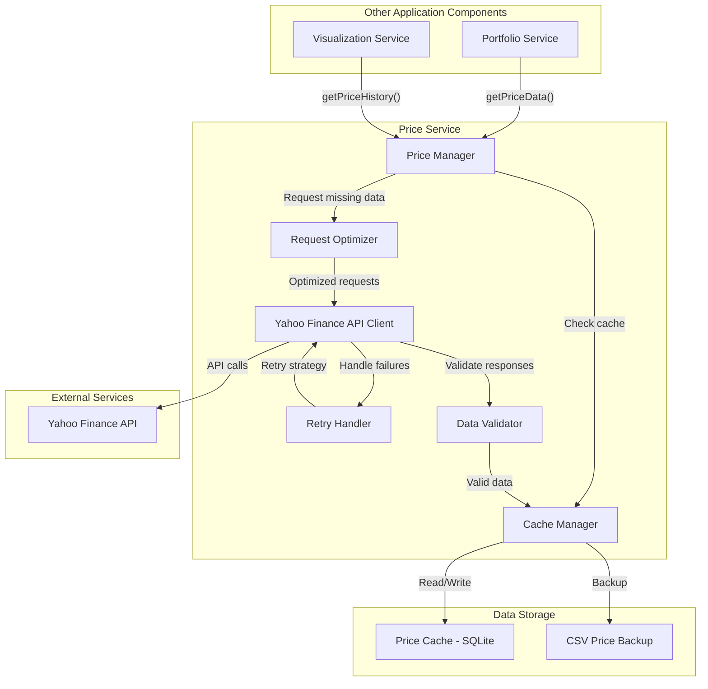

# MyStockTrackerApp - Price Service Component Design

## 1. Overview

The Price Service is a critical component of the MyStockTrackerApp, responsible for retrieving, caching, and managing stock and ETF price data. This document provides a detailed design for the Price Service with special emphasis on handling Yahoo Finance API rate limits through effective caching and request optimization strategies.

## 2. Design Goals

The Price Service is designed with the following primary goals:

1. **Minimize API Calls**: Reduce the number of calls to the Yahoo Finance API to avoid hitting rate limits
2. **Optimize Data Storage**: Store only necessary price data (closing prices only)
3. **Support Fractional Shares**: Ensure all calculations properly handle fractional share quantities
4. **Ensure Data Freshness**: Balance between minimizing API calls and maintaining reasonably fresh data
5. **Handle API Failures**: Implement robust error handling and recovery mechanisms
6. **Support Performance Calculations**: Provide efficient access to historical price data for performance calculations

## 3. Component Architecture

### 3.1 Component Diagram



### 3.2 Component Responsibilities

#### Price Manager
- Central coordination point for price-related operations
- Determines when to use cached data vs. fetching new data
- Interfaces with other application services
- Manages price data for both stocks and ETFs

#### Cache Manager
- Maintains the price data cache
- Implements cache invalidation policies
- Tracks data freshness with timestamps
- Handles periodic CSV backups of price data

#### Yahoo Finance API Client
- Provides a clean interface to the Yahoo Finance API
- Handles authentication and request formatting
- Translates API responses to application data structures

#### Request Optimizer
- Batches multiple price requests when possible
- Prioritizes requests based on application needs
- Implements rate limiting awareness

#### Retry Handler
- Implements exponential backoff for failed requests
- Tracks API errors and response patterns
- Provides circuit-breaking functionality for persistent failures

#### Data Validator
- Ensures received price data is valid and complete
- Handles edge cases (market closures, splits, etc.)
- Normalizes data format

## 4. Data Flow Scenarios

### 4.1 Retrieving Current Price

1. **Portfolio Service requests current price:** `getPrice(ticker)`
2. **Price Manager** receives request and queries **Cache Manager**
3. **Cache Manager** checks if recent price exists (within freshness threshold)
4. If fresh data exists, return it immediately
5. If data is stale or missing:
   - **Request Optimizer** creates an API request
   - **API Client** calls Yahoo Finance API
   - **Retry Handler** manages any failures
   - **Data Validator** validates the response
   - **Cache Manager** stores the new price data
   - Return the validated price data

### 4.2 Retrieving Historical Price Data

1. **Visualization Service requests price history:** `getPriceHistory(tickers, startDate, endDate)`
2. **Price Manager** receives request and queries **Cache Manager**
3. **Cache Manager** identifies which data points exist in cache and which are missing
4. For missing data points:
   - **Request Optimizer** batches requests by date ranges and symbols
   - **API Client** calls Yahoo Finance API with optimized requests
   - **Retry Handler** manages any failures
   - **Data Validator** validates the responses
   - **Cache Manager** stores the new historical data
5. Combine cached and new data and return complete price history

### 4.3 Handling API Failures

1. **API Client** encounters a failure when calling Yahoo Finance API
2. **Retry Handler** activates:
   - For rate limiting errors (429): Implement exponential backoff
   - For temporary errors (5xx): Retry with incremental backoff
   - For persistent failures: Fall back to most recent cached data
3. If retries fail:
   - Log detailed error information
   - Return best available cached data
   - Update UI to indicate data freshness concerns

## 5. Caching Strategy

### 5.1 Cache Structure

The price data cache will be implemented in SQLite with the following schema:

```
Table: PriceCache
- ticker (TEXT) [primary key part 1]
- date (TEXT - ISO format) [primary key part 2]
- close_price (REAL)
- is_intraday (BOOLEAN) - Indicates if this is an intraday price (during market hours) 
- price_timestamp (TEXT - ISO timestamp) - The exact time of the price data
- last_updated (TEXT - ISO timestamp) - When this record was last fetched/updated
```

### 5.2 Data Freshness Policies

The Price Service will implement tiered data freshness policies:

1. **Current Day (Market Hours)**
   - Cache lifetime: 5 minutes
   - Priority for refresh: Highest

2. **Current Day (After Hours)**
   - Cache lifetime: 30 minutes
   - Priority for refresh: High

3. **Recent History (Last 7 days)**
   - Cache lifetime: 6 hours
   - Priority for refresh: Medium

4. **Older History**
   - Cache lifetime: 7 days
   - Priority for refresh: Low

### 5.3 Cache Invalidation

Cache invalidation will occur:
- When freshness thresholds are exceeded
- On application startup for current day data
- When explicitly requested via admin functions

### 5.4 CSV Backup Strategy

In addition to the SQLite cache, price data will be backed up to CSV:
- CSV files organized by ticker symbol
- Written immediately when new data is retrieved
- Serves as both backup and data export mechanism

## 6. API Optimization Techniques

### 6.1 Request Batching

The Yahoo Finance API allows fetching data for multiple symbols in a single request. The Request Optimizer will:
- Group multiple ticker requests into single API calls
- Prioritize symbols based on user interaction patterns
- Limit batch sizes based on API constraints

### 6.2 Rate Limiting Awareness

To prevent hitting API rate limits:
- Track number of requests in rolling time windows
- Implement artificial delays when approaching limits
- Prioritize requests for symbols the user is actively viewing
- Pre-emptively fetch data for commonly accessed symbols

### 6.3 Progressive Symbol Loading

Instead of loading all price data at once:
- First load data for symbols in the active portfolio view
- Then load data for symbols in other portfolios
- Use background processing to complete the dataset

## 7. Error Handling

### 7.1 Retry Strategy

The RetryHandler implements:
- Initial retry after 1 second
- Exponential backoff (1s, 2s, 4s, 8s, etc.)
- Maximum of 5 retries before considering the request failed
- Different strategies based on error type

### 7.2 Fallback Mechanisms

When API requests fail persistently:
- Fall back to most recent cached data
- Clearly indicate data freshness in UI
- Continue retry attempts at reduced frequency
- Log detailed error information for debugging

### 7.3 Circuit Breaker

If Yahoo Finance API shows persistent failures:
- Temporarily halt all non-essential requests
- Implement a circuit breaker with a 15-minute timeout
- After timeout, test with a single low-priority request
- Only resume normal operations after successful test

## 8. Integration with Other Components

### 8.1 Portfolio Service Integration

The Price Service interfaces with the Portfolio Service to:
- Provide current prices for portfolio valuation
- Supply historical prices for performance calculations
- Track hypothetical ETF investments for comparison

### 8.2 Visualization Service Integration

The Price Service interfaces with the Visualization Service to:
- Provide time-series data for performance charts
- Supply price data for investment & gains calculations
- Support age-based performance analysis

## 9. Performance Optimization

### 9.1 Memory Management

To optimize for Heroku's limited resources:
- Implement efficient data structures for price storage
- Use connection pooling for database access
- Release memory as soon as possible after data processing
- Implement LRU (Least Recently Used) eviction for in-memory cache

### 9.2 Query Optimization

For efficient data retrieval:
- Index the price cache by ticker and date
- Pre-aggregate commonly used date ranges
- Use prepared statements for database queries
- Implement query result caching where appropriate

## 10. Testing Strategy

The Price Service testing will focus on:
- Cache hit/miss scenarios
- API failure handling
- Data freshness policies
- Rate limiting behavior

Key test cases include:
1. Retrieving cached vs. non-cached data
2. Handling various API error responses
3. Proper implementation of retry logic
4. Batch request optimization
5. Cache invalidation timing

## 11. Logging Requirements

The Price Service will implement detailed logging:
- Log all API requests and responses
- Track cache hit/miss ratios
- Record data freshness metrics
- Log retry attempts and failures
- Provide performance metrics for optimization

## 12. Future Enhancements

Potential future enhancements include:
1. Predictive prefetching based on user behavior
2. Adaptive freshness thresholds based on market volatility
3. Alternative data sources as fallbacks
4. Support for additional market data (beyond just closing prices)
5. Machine learning for optimizing cache invalidation policies

## 13. Conclusion

The Price Service design prioritizes efficient use of the Yahoo Finance API while ensuring the application has access to the price data it needs. By implementing robust caching, request optimization, and error handling, the service will provide reliable price data even with the constraints of the free Yahoo Finance API tier and Heroku's free hosting limitations.